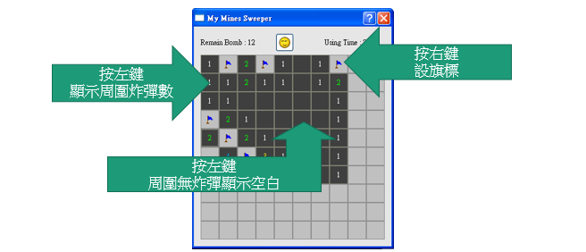

Mines Sweeper
==============

使用Qt跨平台開發的踩地雷小遊戲，實作於附觸控面板的Andes開發板

### Qt
[Qt](https://zh.wikipedia.org/wiki/Qt) 是一個跨平台的C++應用程式開發框架，廣泛用於開發GUI程式。

### 遊戲描述
- 在地雷區內，隨機散佈炸彈。
- 對地雷區按鈕按下滑鼠右鍵，會對此按鈕做旗標，並將未找到的炸彈數減一。
- 對按鈕按下滑鼠左鍵後，若不是炸彈則會顯示出相鄰的8個按鈕內藏幾顆炸彈，若所按下的按鈕為炸彈，則遊戲結束，顯示出所有炸彈位置及標錯的位置。
- 當所有非炸彈的按鈕全案下時即贏了這局，遊戲結束並跳出對話框顯示此局所花費的時間。

### 功能說明
- 顯示未找到炸彈數量，每增加一個旗標就減一，可顯示到負數。
- 設置一計時器，計算遊戲所花秒數，在使用者按下地雷區中任一個按鈕時才開始計時。
- 設置重新開始的按鈕，按下後遊戲回到初始狀態。
- 對按鈕按下滑鼠右鍵，按鈕不會被按下，而是會對此按鈕做旗標，並將未找到的炸彈數減一；對做過旗標的按鈕再按一下滑鼠右鍵，旗標會消失，恢復一開始的狀態。
- 對按鈕按下滑鼠左鍵，按鈕會被按下，若不是炸彈則會顯示出相鄰的8個按鈕內藏有的炸彈數量，若相鄰邊無炸彈，則顯示空白並連同按下此空白的8個相鄰按鈕；若所按下的按鈕為炸彈，則遊戲結束，顯示出所有炸彈位置及標錯的位置。
- 若炸彈全部找完，也無任何錯誤，並且按鈕全部按下，則時間暫停，遊戲結束。

### 截圖說明

### UML

